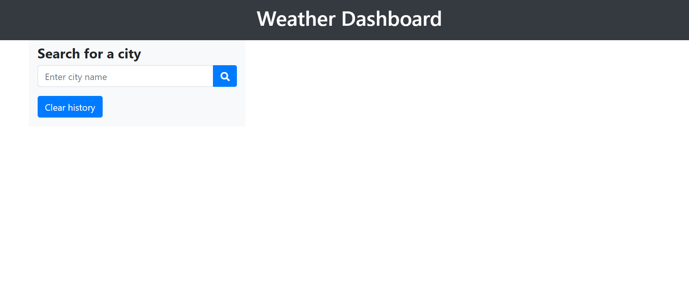
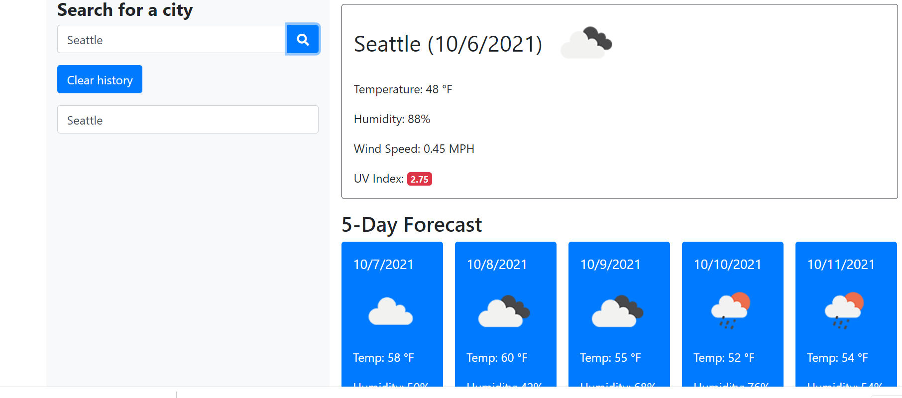

# Homework Day 5
## Weather Dashboard
Weather dashboard is an application that lets travelors know the weather conditions of acity with a 5 day forecast.


## User Story

```
AS A traveler
I WANT to see the weather outlook for multiple cities
SO THAT I can plan a trip accordingly
```
The following images shows the web application's appearance and functionality:




## Technology
HTML,CSS,JavaScript,Bootstrap,axios,openweathermapAPI

### Links 
* [*GitHub repository*](https://github.com/daliyaebenny/Weather-Dashboard.git)   
* [*GitHub pages*](https://daliyaebenny.github.io/Weather-Dashboard/)